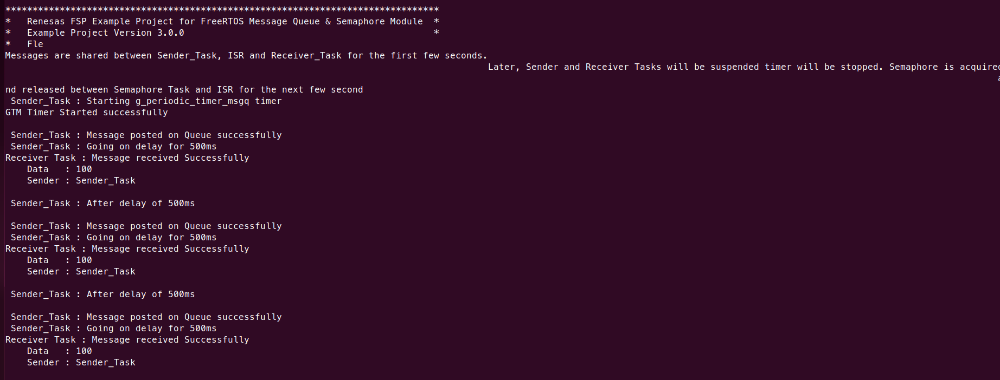
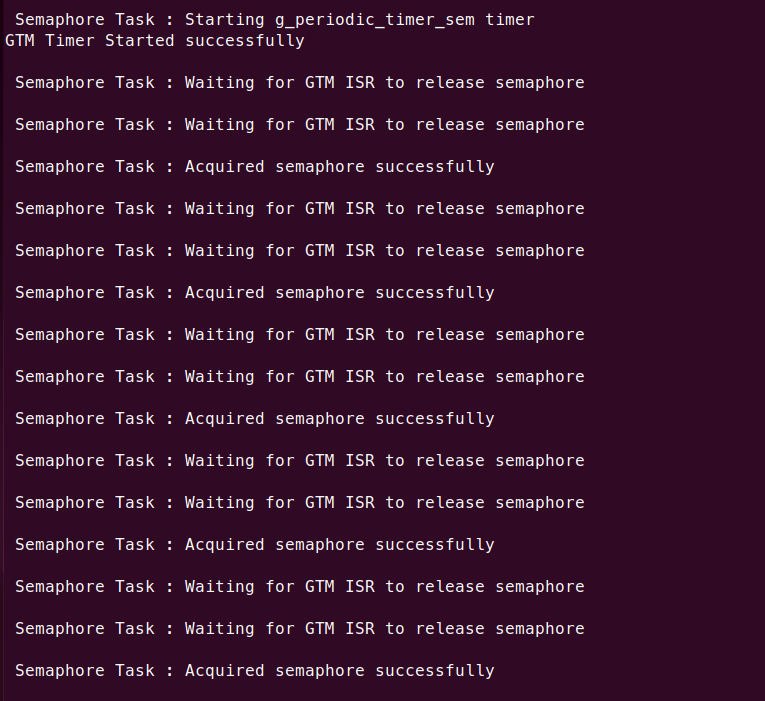

# Kakip FreeRTOS Example for CM33 / CR8

A FreeRTOS demo running on CM33, CR8_0, or CR8_1 cores. The firmware demonstrates message queues, binary semaphores, and ISR-to-task synchronization. The demo runs continuously in cycles, printing status via SCI5 UART.

## Prerequisites

- Kakip board with OS image from Kakip official website <https://www.kakip.ai/>
- USB-UART adapter (e.g., Pmod USBUART, FTDI cable)
- Serial terminal software (TeraTerm, minicom, etc.)
- e2 studio with RZ/V2H FSP support
- GCC ARM Embedded toolchain (13.3.1.arm-13-24)

## Hardware Connection

### UART Console

Connect the USB-UART adapter to the **40-pin GPIO header (CN6)** for serial output:

| CN6 Pin | Signal                  | Connect to           |
| ------- | ----------------------- | -------------------- |
| 6       | GND                     | Adapter GND from PC  |
| 8       | GPIO14 (P7_2) RSCI5_TXD | Adapter RXD from PC  |
| 10      | GPIO15 (P7_3) RSCI5_RXD | Adapter TXD from PC  |

## Build

### 1. Clone the Repository

```bash
$ git clone https://github.com/YDS-Kakip-Team/kakip_cm33_cr8_example.git
```

### 2. Apply Kernel Patches

Apply the following patches to the Kakip Linux kernel source.
Without these patches, the UART will stop working after Linux boots.

```bash
$ cd <kakip_linux>
$ git apply <repo_path>/kakip_uart_example/kakip_linux/arch/arm64/boot/dts/renesas/kakip-es1.dts.diff
$ git apply <repo_path>/kakip_uart_example/kakip_linux/drivers/clk/renesas/r9a09g057-cpg.c.diff
```

| Patch | Purpose |
|-------|---------|
| `kakip-es1.dts.diff` | Disable `&sci5` to prevent Linux serial driver from probing |
| `r9a09g057-cpg.c.diff` | Mark RSCI5 clocks as critical to prevent clock gating |

> **Important:** Rebuild the kernel and deploy the updated Image and DTB to the SD card.
> For kernel build and deploy instructions, refer to the [Kernel Update Guide](../../Kernel-Update_Guide/Kernel-Update_Guide.md).

### 3. Build Projects

For e2 studio import, preceding project build, generate project content, and build instructions, refer to the [Kakip UART Example Guide (Kakip_UART_Example_Guide.md)](../uart_example/Kakip_UART_Example_Guide.md#3-open-e2-studio-and-import-projects).

### Build Output

| Core | Binary | Location |
|------|--------|----------|
| CM33 | `freertos_kakip_cm33_ep.bin` | `Release/` |
| CR8_0 | `freertos_kakip_cr8_0_ep_itcm.bin` + `_sram.bin` | `Release/` |
| CR8_1 | `freertos_kakip_cr8_1_ep_itcm.bin` + `_sram.bin` | `Release/` |

## Deploy

Insert the Kakip SD card into the host PC and mount the boot partition:

```bash
# Check the device name (e.g., /dev/sdb)
$ lsblk

# Mount the boot partition (partition 1)
$ sudo mount /dev/sd<X>1 /mnt
```

Copy all firmware binaries to the boot partition:

```bash
# CM33
$ sudo cp freertos_kakip_cm33_ep.bin /mnt/

# CR8_0
$ sudo cp freertos_kakip_cr8_0_ep_itcm.bin /mnt/
$ sudo cp freertos_kakip_cr8_0_ep_sram.bin /mnt/

# CR8_1
$ sudo cp freertos_kakip_cr8_1_ep_itcm.bin /mnt/
$ sudo cp freertos_kakip_cr8_1_ep_sram.bin /mnt/

$ sudo umount /mnt
```

## Run

Stop at the U-Boot prompt (`=>`) by pressing any key during boot. Load **one** firmware at a time, then boot Linux.

> **Note:** These projects are independent and share the same UART port (SCI5). Only run one at a time.

### CM33

```
=> setenv cm33start 'dcache off; mw.l 0x10420D2C 0x02000000; mw.l 0x1043080c 0x08003000; mw.l 0x10430810 0x18003000; mw.l 0x10420604 0x00040004; mw.l 0x10420C1C 0x00003100; mw.l 0x10420C0C 0x00000001; mw.l 0x10420904 0x00380008; mw.l 0x10420904 0x00380038; fatload mmc 0:1 0x08001e00 freertos_kakip_cm33_ep.bin; mw.l 0x10420C0C 0x00000000; dcache on'
=> saveenv
=> run cm33start
=> boot
```

### CR8_0

```
=> setenv cr8start 'dcache off; mw.l 0x10420D24 0x04000000; mw.l 0x10420600 0xE000E000; mw.l 0x10420604 0x00030003; mw.l 0x10420908 0x1FFF0000; mw.l 0x10420C44 0x003F0000; mw.l 0x10420C14 0x00000000; mw.l 0x10420908 0x10001000; mw.l 0x10420C48 0x00000020; mw.l 0x10420908 0x1FFF1FFF; mw.l 0x10420C48 0x00000000; fatload mmc 0:1 0x12040000 freertos_kakip_cr8_0_ep_itcm.bin; fatload mmc 0:1 0x08180000 freertos_kakip_cr8_0_ep_sram.bin; mw.l 0x10420C14 0x00000003; dcache on;'
=> saveenv
=> run cr8start
=> boot
```

### CR8_1

```
=> setenv cr81start 'dcache off; mw.l 0x10420D24 0x04000000; mw.l 0x10420600 0xE000E000; mw.l 0x10420604 0x00030003; mw.l 0x10420908 0x1FFF0000; mw.l 0x10420C44 0x003F0000; mw.l 0x10420C14 0x00000000; mw.l 0x10420908 0x10001000; mw.l 0x10420C48 0x00000020; mw.l 0x10420908 0x1FFF1FFF; mw.l 0x10420C48 0x00000000; fatload mmc 0:1 0x12080000 freertos_kakip_cr8_1_ep_itcm.bin; fatload mmc 0:1 0x081C0000 freertos_kakip_cr8_1_ep_sram.bin; mw.l 0x10420C14 0x00000003; dcache on;'
=> saveenv
=> run cr81start
=> boot
```

## Demo Overview

The demo runs two phases in a continuous cycle:

### Phase 1: Message Queue (~10 seconds)

1. **GTM timer** fires every 1 second, ISR sends a message to the queue
2. **Sender Task** also sends messages to the queue every 500ms
3. **Receiver Task** receives messages from the queue and prints them
4. After 10 ISR ticks, the timer stops and both tasks are suspended

### Phase 2: Binary Semaphore (~10 seconds)

1. **GTM timer** fires every 1 second, ISR gives a semaphore
2. **Semaphore Task** takes the semaphore and prints acquisition count
3. After 10 ISR ticks, the timer stops and the task cycle restarts

After both phases complete, the cycle counter increments and the demo restarts from Phase 1.

## Expected Results

Serial terminal (115200 8N1) shows continuous cycling output:

**Phase 1 — Message Queue:**



**Phase 2 — Binary Semaphore:**




## Troubleshooting

### UART stops working after Linux boots

Serial terminal has no response after Linux boots.

**Cause:** Linux CPG driver gates the SCI5 clock.
**Solution:** Apply the kernel patches (see Build Step 2).

### e2 studio: "Invalid device family context"

**Cause:** Preceding project was renamed.
**Solution:** Keep original name `preceding_rzv2h_evk_cm33_ep`.

### e2 studio: "Smart Bundle file is missing"

**Cause:** Preceding project not built yet.
**Solution:** Build `preceding_rzv2h_evk_cm33_ep` first (see [Kakip UART Example Guide (Kakip_UART_Example_Guide.md)](../uart_example/Kakip_UART_Example_Guide.md#4-build-preceding-project-required-for-cr8)).

### CR8: "cannot open linker script file memory_regions.ld"

**Cause:** Generate Project Content not executed.
**Solution:** Open `configuration.xml` -> **Generate Project Content** -> Build.

### Demo stops after one cycle

**Cause:** Using the original Renesas example without cycle modifications.
**Solution:** Use the Kakip-modified version from this repository.

### Receiver Task crash / UART deadlock

**Cause:** Receiver Task stack too small (original: 512 bytes). `console_print` allocates a 256-byte buffer on stack, causing stack overflow.
**Solution:** Increase Receiver Task stack to 1024 bytes in e2 studio configuration.
