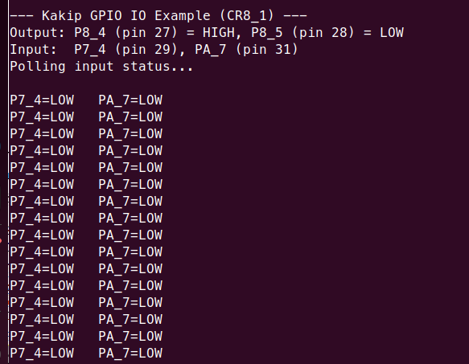

# Kakip GPIO IO Example for CM33 / CR8

A GPIO input/output example using the Kakip 40-pin GPIO header. The firmware sets two output pins (one HIGH, one LOW) and polls two input pins, printing the status via SCI5 UART every 500ms.

## Prerequisites

- Kakip board with OS image from Kakip official website <https://www.kakip.ai/>
- USB-UART adapter (e.g., Pmod USBUART, FTDI cable)
- Serial terminal software (TeraTerm, minicom, etc.)
- e2 studio with RZ/V2H FSP support
- GCC ARM Embedded toolchain (13.3.1.arm-13-24)

## Hardware Connection

### UART Console

Connect the USB-UART adapter to the **40-pin GPIO header (CN6)** for serial output:

| CN6 Pin | Signal                  | Connect to           |
| ------- | ----------------------- | -------------------- |
| 6       | GND                     | Adapter GND from PC  |
| 8       | GPIO14 (P7_2) RSCI5_TXD | Adapter RXD from PC  |
| 10      | GPIO15 (P7_3) RSCI5_RXD | Adapter TXD from PC  |

### GPIO Pins

| CN6 Pin | Signal          | Direction | Description              |
| ------- | --------------- | --------- | ------------------------ |
| 27      | GPIO0 (P8_4)    | Output    | Set to HIGH by firmware  |
| 28      | GPIO1 (P8_5)    | Output    | Set to LOW by firmware   |
| 29      | GPIO5 (P7_4)    | Input     | Read and printed via UART |
| 31      | GPIO6 (PA_7)    | Input     | Read and printed via UART |

To test input pins, connect them to the output pins (P8_4 for HIGH, P8_5 for LOW) or to 3.3V / GND externally.

## Build

### 1. Clone the Repository

```bash
$ git clone https://github.com/YDS-Kakip-Team/kakip_cm33_cr8_example.git
```

### 2. Apply Kernel Patches

Apply the following patches to the Kakip Linux kernel source.
Without these patches, the UART will stop working after Linux boots.

```bash
$ cd <kakip_linux>
$ git apply <repo_path>/kakip_uart_example/kakip_linux/arch/arm64/boot/dts/renesas/kakip-es1.dts.diff
$ git apply <repo_path>/kakip_uart_example/kakip_linux/drivers/clk/renesas/r9a09g057-cpg.c.diff
```

| Patch | Purpose |
|-------|---------|
| `kakip-es1.dts.diff` | Disable `&sci5` to prevent Linux serial driver from probing |
| `r9a09g057-cpg.c.diff` | Mark RSCI5 clocks as critical to prevent clock gating |

> **Important:** Rebuild the kernel and deploy the updated Image and DTB to the SD card.
> For kernel build and deploy instructions, refer to the [Kernel Update Guide](../../Kernel-Update_Guide/Kernel-Update_Guide.md).

### 3. Build Projects

For e2 studio import, preceding project build, generate project content, and build instructions, refer to the [Kakip UART Example Guide (Kakip_UART_Example_Guide.md)](../uart_example/Kakip_UART_Example_Guide.md#3-open-e2-studio-and-import-projects).

### Build Output

| Core | Binary | Location |
|------|--------|----------|
| CM33 | `gpio_io_kakip_cm33_ep.bin` | `Release/` |
| CR8_0 | `gpio_io_kakip_cr8_0_ep_itcm.bin` + `_sram.bin` | `Release/` |
| CR8_1 | `gpio_io_kakip_cr8_1_ep_itcm.bin` + `_sram.bin` | `Release/` |

## Deploy

Insert the Kakip SD card into the host PC and mount the boot partition:

```bash
# Check the device name (e.g., /dev/sdb)
$ lsblk

# Mount the boot partition (partition 1)
$ sudo mount /dev/sd<X>1 /mnt
```

Copy all firmware binaries to the boot partition:

```bash
# CM33
$ sudo cp gpio_io_kakip_cm33_ep.bin /mnt/

# CR8_0
$ sudo cp gpio_io_kakip_cr8_0_ep_itcm.bin /mnt/
$ sudo cp gpio_io_kakip_cr8_0_ep_sram.bin /mnt/

# CR8_1
$ sudo cp gpio_io_kakip_cr8_1_ep_itcm.bin /mnt/
$ sudo cp gpio_io_kakip_cr8_1_ep_sram.bin /mnt/

$ sudo umount /mnt
```

## Run

Stop at the U-Boot prompt (`=>`) by pressing any key during boot. Load **one** firmware at a time, then boot Linux.

> **Note:** These projects are independent and share the same UART port (SCI5). Only run one at a time.

### CM33

```
=> setenv cm33start 'dcache off; mw.l 0x10420D2C 0x02000000; mw.l 0x1043080c 0x08003000; mw.l 0x10430810 0x18003000; mw.l 0x10420604 0x00040004; mw.l 0x10420C1C 0x00003100; mw.l 0x10420C0C 0x00000001; mw.l 0x10420904 0x00380008; mw.l 0x10420904 0x00380038; fatload mmc 0:1 0x08001e00 gpio_io_kakip_cm33_ep.bin; mw.l 0x10420C0C 0x00000000; dcache on'
=> saveenv
=> run cm33start
=> boot
```

### CR8_0

```
=> setenv cr8start 'dcache off; mw.l 0x10420D24 0x04000000; mw.l 0x10420600 0xE000E000; mw.l 0x10420604 0x00030003; mw.l 0x10420908 0x1FFF0000; mw.l 0x10420C44 0x003F0000; mw.l 0x10420C14 0x00000000; mw.l 0x10420908 0x10001000; mw.l 0x10420C48 0x00000020; mw.l 0x10420908 0x1FFF1FFF; mw.l 0x10420C48 0x00000000; fatload mmc 0:1 0x12040000 gpio_io_kakip_cr8_0_ep_itcm.bin; fatload mmc 0:1 0x08180000 gpio_io_kakip_cr8_0_ep_sram.bin; mw.l 0x10420C14 0x00000003; dcache on;'
=> saveenv
=> run cr8start
=> boot
```

### CR8_1

```
=> setenv cr81start 'dcache off; mw.l 0x10420D24 0x04000000; mw.l 0x10420600 0xE000E000; mw.l 0x10420604 0x00030003; mw.l 0x10420908 0x1FFF0000; mw.l 0x10420C44 0x003F0000; mw.l 0x10420C14 0x00000000; mw.l 0x10420908 0x10001000; mw.l 0x10420C48 0x00000020; mw.l 0x10420908 0x1FFF1FFF; mw.l 0x10420C48 0x00000000; fatload mmc 0:1 0x12080000 gpio_io_kakip_cr8_1_ep_itcm.bin; fatload mmc 0:1 0x081C0000 gpio_io_kakip_cr8_1_ep_sram.bin; mw.l 0x10420C14 0x00000003; dcache on;'
=> saveenv
=> run cr81start
=> boot
```

## Expected Results

- Serial terminal (115200 8N1) shows banner and polls input pin status every 500ms
- Output pins: P8_4 reads HIGH (3.3V), P8_5 reads LOW (0V) when measured with a multimeter
- Input pins: connect to 3.3V or GND to see status change



## Troubleshooting

### UART stops working after Linux boots

Serial terminal has no response after Linux boots.

**Cause:** Linux CPG driver gates the SCI5 clock.
**Solution:** Apply the kernel patches (see Build Step 2).

### e2 studio: "Invalid device family context"

**Cause:** Preceding project was renamed.
**Solution:** Keep original name `preceding_rzv2h_evk_cm33_ep`.

### e2 studio: "Smart Bundle file is missing"

**Cause:** Preceding project not built yet.
**Solution:** Build `preceding_rzv2h_evk_cm33_ep` first (see [Kakip UART Example Guide (Kakip_UART_Example_Guide.md)](../uart_example/Kakip_UART_Example_Guide.md#4-build-preceding-project-required-for-cr8)).

### CR8: "cannot open linker script file memory_regions.ld"

**Cause:** Generate Project Content not executed.
**Solution:** Open `configuration.xml` -> **Generate Project Content** -> Build.

### Input pin always reads LOW

**Cause:** Pin not connected or floating.
**Solution:** Connect the input pin to P8_4 (pin 27, output HIGH) with a jumper wire to verify HIGH reading.
