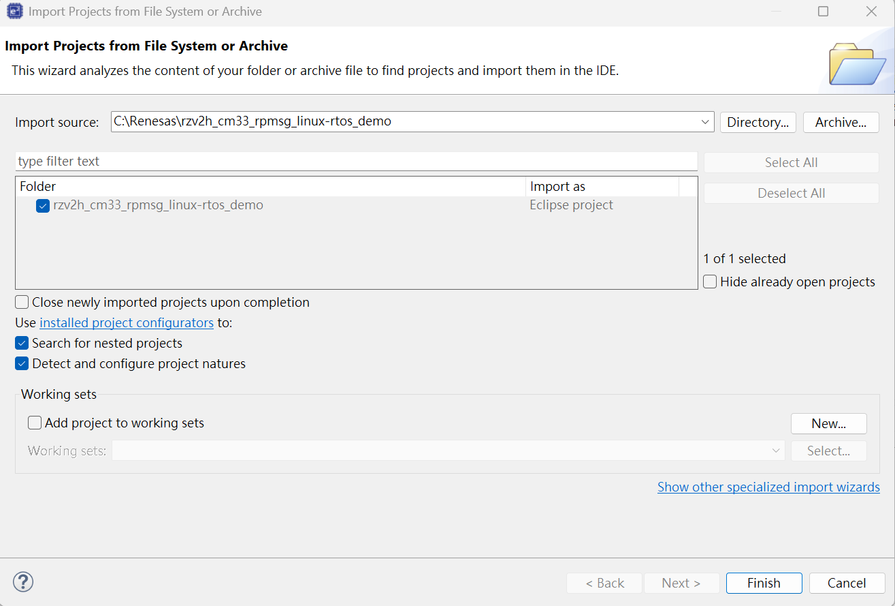
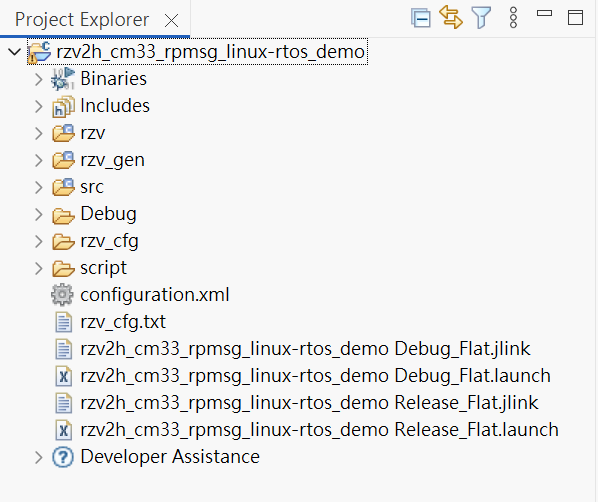
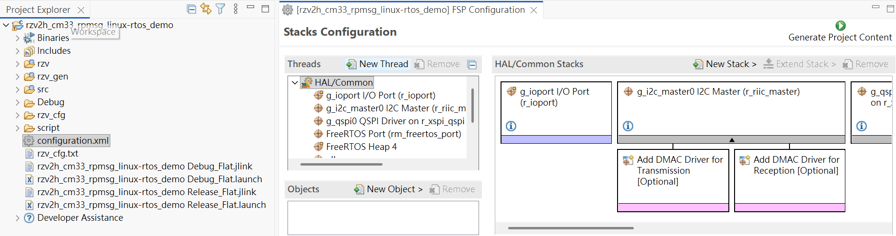
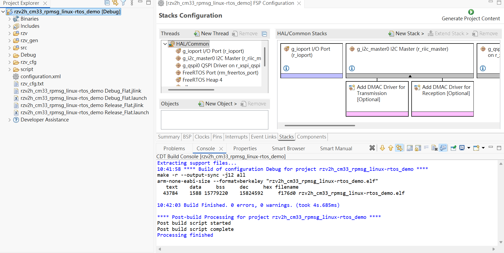

# Kakip CM33 Remoteproc User Guide

This guide describes how to use Linux remoteproc on Kakip to load, start, and stop Cortex-M33 firmware.
The flow in this document is Linux-first: CM33 firmware is loaded by the Linux remoteproc driver, not by TF-A.

If TF-A or another boot stage has already started CM33, Linux remoteproc may report:

```text
CM33 remoteproc is NOT supported because CM33 clock is already ON
```

## Prerequisites

- Kakip board
- Bootable SD card with Kakip Linux image
- Linux kernel source: <https://github.com/YDS-Kakip-Team/kakip_linux>
- U-Boot source: <https://github.com/YDS-Kakip-Team/kakip_u-boot>
- TF-A source: <https://github.com/YDS-Kakip-Team/kakip_trusted-firmware>
- CM33 firmware example: [rzv2h_cm33_rpmsg_linux-rtos_demo.elf](firmware/rzv2h_cm33_rpmsg_linux-rtos_demo.elf)

## Build

### 1. Clone the Repository

```bash
$ git clone https://github.com/YDS-Kakip-Team/kakip_cm33_cr8_example.git
```

The remoteproc e2 studio project used in this guide is located at:

```text
kakip_cm33_cr8_example/kakip_remoteproc/rzv2h_cm33_rpmsg_linux-rtos_demo/
```

In the following commands, use `<kakip_cm33_cr8_example_path>` to refer to the local path of this repository.

### 2. Open e2 studio and Import Projects

1. Launch e2 studio and select a workspace. Do not use the repository directory as the workspace.
2. Click `File -> Open Projects From File System...`.
3. Click **Directory...** and select:

```text
kakip_cm33_cr8_example/kakip_remoteproc/
```

4. e2 studio should detect the `rzv2h_cm33_rpmsg_linux-rtos_demo` project automatically.
5. Select the project and click **Finish**.



> **Note:** Do **not** check `Copy projects into workspace`.

After import, Project Explorer should show:

```text
rzv2h_cm33_rpmsg_linux-rtos_demo
```



### 3. Generate Project Content and Build Project

1. Double-click `configuration.xml` to open the FSP configurator.
2. Click **Generate Project Content**.
3. Right-click the project -> `Build Configurations -> Set Active -> Release`.
4. Right-click the project -> **Build Project**.



The project includes a post-build step in `script/postbuild.sh`.
For the CM33 build, the post-build step generates `.bin` and `.srec` outputs from the ELF file.

Build output is expected under:

```text
rzv2h_cm33_rpmsg_linux-rtos_demo/Release/
```

The main firmware file used by Linux remoteproc is:

```text
rzv2h_cm33_rpmsg_linux-rtos_demo.elf
```



### 4. Apply Linux Patches

Repository information:

- Repository: <https://github.com/YDS-Kakip-Team/kakip_linux>
- Branch: `main`
- Base commit: `a8c25b00db8fd2cf08bdf757128b97aafa6927ec`

Apply the following patches to the Kakip Linux kernel source in order:

```bash
$ cd <kakip_linux>
$ git apply <kakip_cm33_cr8_example_path>/CM33_Remoteproc_Guide/patch/kakip_linux/0001-drivers-clk-renesas-Add-CM33-clock-and-resets.patch
$ git apply <kakip_cm33_cr8_example_path>/CM33_Remoteproc_Guide/patch/kakip_linux/0002-dt-bindings-remoteproc-Add-Renesas-RZ-CM33-binding.patch
$ git apply <kakip_cm33_cr8_example_path>/CM33_Remoteproc_Guide/patch/kakip_linux/0003-drivers-remoteproc-Add-Renesas-RZ-CM33-support.patch
$ git apply <kakip_cm33_cr8_example_path>/CM33_Remoteproc_Guide/patch/kakip_linux/0004-arm64-dts-renesas-kakip-es1-Add-Kakip-CM33-remotepro.patch
$ git apply <kakip_cm33_cr8_example_path>/CM33_Remoteproc_Guide/patch/kakip_linux/0005-arm64-configs-kakip-Enable-RZ-remoteproc-support.patch
```

| Patch | Purpose |
|-------|---------|
| [0001-drivers-clk-renesas-Add-CM33-clock-and-resets.patch](patch/kakip_linux/0001-drivers-clk-renesas-Add-CM33-clock-and-resets.patch) | Add CM33 clock and reset support |
| [0002-dt-bindings-remoteproc-Add-Renesas-RZ-CM33-binding.patch](patch/kakip_linux/0002-dt-bindings-remoteproc-Add-Renesas-RZ-CM33-binding.patch) | Add Renesas RZ CM33 remoteproc binding |
| [0003-drivers-remoteproc-Add-Renesas-RZ-CM33-support.patch](patch/kakip_linux/0003-drivers-remoteproc-Add-Renesas-RZ-CM33-support.patch) | Add RZ CM33 remoteproc driver support |
| [0004-arm64-dts-renesas-kakip-es1-Add-Kakip-CM33-remotepro.patch](patch/kakip_linux/0004-arm64-dts-renesas-kakip-es1-Add-Kakip-CM33-remotepro.patch) | Add Kakip ES1 CM33 remoteproc node |
| [0005-arm64-configs-kakip-Enable-RZ-remoteproc-support.patch](patch/kakip_linux/0005-arm64-configs-kakip-Enable-RZ-remoteproc-support.patch) | Enable remoteproc-related kernel config |

Kernel config should include:

```text
CONFIG_REMOTEPROC=y
CONFIG_REMOTEPROC_CDEV=y
CONFIG_RZ_REMOTEPROC=y
```

The current `kakip.config` still does not enable:

```text
# CONFIG_RPMSG_VIRTIO is not set
```

The current `rz_rproc.c` kick callback also notes that Linux RPMsg is not supported yet.
This guide therefore focuses on firmware load, start, and stop only.

Rebuild the kernel and deploy the updated Image and `kakip-es1.dtb` to the SD card after applying the patches.
For Linux kernel build and deploy instructions, refer to the [Kernel Update Guide](../Kernel-Update_Guide/Kernel-Update_Guide.md).

### 5. Apply U-Boot Patch

Repository information:

- Repository: <https://github.com/YDS-Kakip-Team/kakip_u-boot>
- Branch: `main`
- Base commit: `e6d0f29793d709b941cc718e9ec3a33cf0e291d9`

Apply the following patch to the Kakip U-Boot source:

```bash
$ cd <kakip_u-boot>
$ git apply <kakip_cm33_cr8_example_path>/CM33_Remoteproc_Guide/patch/kakip_u-boot/0001-configs-kakip-es1_defconfig-increase-LMB-regions-for.patch
```

| Patch | Purpose |
|-------|---------|
| [0001-configs-kakip-es1_defconfig-increase-LMB-regions-for.patch](patch/kakip_u-boot/0001-configs-kakip-es1_defconfig-increase-LMB-regions-for.patch) | Increase `CONFIG_LMB_MAX_REGIONS` for reserved-memory handling |

This patch sets:

```text
CONFIG_LMB_MAX_REGIONS=16
```

This patch is not for U-Boot remoteproc commands. It avoids LMB failures when the Linux device tree reserved-memory regions increase.

For U-Boot build and deploy instructions, refer to:
<https://github.com/YDS-Kakip-Team/kakip_u-boot/blob/main/README.md>

### 6. Apply TF-A Patches

Repository information:

- Repository: <https://github.com/YDS-Kakip-Team/kakip_trusted-firmware>
- Branch: `main`
- Base commit: `b770a05046ce52a052c04cd6345effca1c473847`

Apply the following patches to the Kakip TF-A source in order:

```bash
$ cd <kakip_trusted-firmware>
$ git apply <kakip_cm33_cr8_example_path>/CM33_Remoteproc_Guide/patch/kakip_trusted-firmware/0001-plat-renesas-rzv2h-make-MCPU-SRAM-access-configurabl.patch
$ git apply <kakip_cm33_cr8_example_path>/CM33_Remoteproc_Guide/patch/kakip_trusted-firmware/0002-plat-renesas-rzv2h-add-BL22-loading-support-for-CM33.patch
$ git apply <kakip_cm33_cr8_example_path>/CM33_Remoteproc_Guide/patch/kakip_trusted-firmware/0003-plat-renesas-rzv2h-add-CM33-boot-control.patch
$ git apply <kakip_cm33_cr8_example_path>/CM33_Remoteproc_Guide/patch/kakip_trusted-firmware/0004-plat-renesas-rzv2h-support-CM33-first-CA55-clockup-f.patch
```

| Patch | Purpose |
|-------|---------|
| [0001-plat-renesas-rzv2h-make-MCPU-SRAM-access-configurabl.patch](patch/kakip_trusted-firmware/0001-plat-renesas-rzv2h-make-MCPU-SRAM-access-configurabl.patch) | Allow non-secure access to MCPU SRAM for Linux remoteproc |
| [0002-plat-renesas-rzv2h-add-BL22-loading-support-for-CM33.patch](patch/kakip_trusted-firmware/0002-plat-renesas-rzv2h-add-BL22-loading-support-for-CM33.patch) | Add BL22 loading support for CM33 firmware flow |
| [0003-plat-renesas-rzv2h-add-CM33-boot-control.patch](patch/kakip_trusted-firmware/0003-plat-renesas-rzv2h-add-CM33-boot-control.patch) | Add CM33 boot control support in TF-A |
| [0004-plat-renesas-rzv2h-support-CM33-first-CA55-clockup-f.patch](patch/kakip_trusted-firmware/0004-plat-renesas-rzv2h-support-CM33-first-CA55-clockup-f.patch) | Add CM33-first / CA55 clock-up related support |

Build TF-A with MCPU SRAM access enabled:

```bash
$ make -j8 PLAT=v2h BOARD=evk_1 ENABLE_STACK_PROTECTOR=default \
    ENABLE_SRAM_REGION_ACCESS_MCPU=1 bl2 bl31
```

Do **not** add the following options, otherwise the flow changes to TF-A loading or starting CM33:

```text
ENABLE_CM33_FIRMWARE_LOAD=1
ENABLE_CA55_CLOCKUP=1
```

For TF-A build and deploy instructions, refer to:
<https://github.com/YDS-Kakip-Team/kakip_trusted-firmware/blob/main/README.md>

## Difference Between a Generic FSP Firmware and a Remoteproc-Loadable Firmware

A generic FSP firmware project is not always suitable for Linux remoteproc.
Even if the firmware can be built and run by other loading methods, Linux remoteproc expects the firmware image to follow a layout and metadata format that it can recognize.

### What a Generic FSP Firmware Usually Lacks

Compared with a firmware project prepared for Linux remoteproc, a generic FSP firmware usually does not include:

- a linker script prepared for the Linux remoteproc loading layout
- the memory placement expected by the CM33 remoteproc flow
- project settings verified against the Linux remoteproc boot path
- firmware layout aligned with the reserved memory / load address arrangement used on the target platform

Because of that, Linux remoteproc may not be able to load or interpret the firmware image as expected.

### What a Remoteproc-Loadable Firmware Adds

A firmware that is intended to be loaded by Linux remoteproc needs extra project content beyond a generic FSP template.
In the reference project:

```text
kakip_cm33_cr8_example/kakip_remoteproc/rzv2h_cm33_rpmsg_linux-rtos_demo/
```

the following files provide the remoteproc-loadable structure:

- `script/rzv2h_evk_cm.ld`

This linker script defines a CM33 firmware image layout that is prepared for the Linux remoteproc flow, including dedicated memory placement for the boot parameter area, SRAM code/data area, and the remoteproc-related reserved regions used by this project.

### This Firmware Project Supports Linux Remoteproc Loading

The firmware project used in this guide:

```text
kakip_cm33_cr8_example/kakip_remoteproc/rzv2h_cm33_rpmsg_linux-rtos_demo/
```

is already prepared for Linux remoteproc loading.
It is not just a generic FSP example project.

In particular, its linker script `script/rzv2h_evk_cm.ld` is designed for this CM33 remoteproc use case.

When building this project for Linux remoteproc, the firmware file to use is:

```text
rzv2h_cm33_rpmsg_linux-rtos_demo.elf
```

The project post-build script also generates `.bin` and `.srec`, but for Linux remoteproc the correct input is the ELF file.

## Deploy Firmware

Insert the Kakip SD card into the host PC and mount the rootfs partition:

```bash
# Check the device name (example: /dev/sdb)
$ lsblk

# Mount the rootfs partition (partition 2)
$ sudo mount /dev/sd<X>2 /mnt
```

Copy the firmware to `/lib/firmware`:

```bash
$ sudo mkdir -p /mnt/lib/firmware
$ sudo cp CM33_Remoteproc_Guide/firmware/rzv2h_cm33_rpmsg_linux-rtos_demo.elf /mnt/lib/firmware/
$ sync
$ sudo umount /mnt
```

`/dev/sd<X>2` should be replaced with the actual rootfs partition on the SD card.
If you rename the firmware file, use the same name later through remoteproc sysfs.

## Run

Boot Linux and confirm that a remoteproc device exists:

```bash
$ dmesg | grep -i -E 'remoteproc|rz-rproc|cm33'
$ ls /sys/class/remoteproc/
```

Find the CM33 remoteproc node:

```bash
$ for r in /sys/class/remoteproc/remoteproc*; do
>   echo "$r: $(cat $r/name)"
> done
```

Assume CM33 is `remoteproc0`:

```bash
$ RPROC=/sys/class/remoteproc/remoteproc0
```

Set the firmware name:

```bash
$ sudo sh -c 'echo rzv2h_cm33_rpmsg_linux-rtos_demo.elf > "$RPROC/firmware"'
$ cat $RPROC/firmware
```

Start CM33:

```bash
$ cat $RPROC/state
$ sudo sh -c 'echo start > "$RPROC/state"'
$ cat $RPROC/state
$ dmesg | tail -n 100
```

Stop CM33:

```bash
$ sudo sh -c 'echo stop > "$RPROC/state"'
$ cat $RPROC/state
```

## Expected Results

- `/sys/class/remoteproc/remoteprocX` is present after Linux boots
- `sudo sh -c 'echo rzv2h_cm33_rpmsg_linux-rtos_demo.elf > "$RPROC/firmware"'` completes successfully
- `sudo sh -c 'echo start > "$RPROC/state"'` changes the state to `running`
- `dmesg` shows remoteproc load/start messages without CM33 clock conflict errors

Example `dmesg` output after CM33 starts successfully:

```text
[ 4311.855034] remoteproc remoteproc0: powering up cm33
[ 4311.970157] remoteproc remoteproc0: Booting fw image rzv2h_cm33_rpmsg_linux-rtos_demo.elf, size 1711368
[ 4311.970293] remoteproc remoteproc0: unsupported resource 4
[ 4311.974126] remoteproc remoteproc0: remote processor cm33 is now up
```

## Troubleshooting

### `/sys/class/remoteproc/remoteproc0` does not exist

Check the kernel config:

```bash
$ zcat /proc/config.gz | grep -E 'REMOTEPROC|RZ_REMOTEPROC'
```

Check the boot log:

```bash
$ dmesg | grep -i -E 'remoteproc|rz-rproc|cm33'
```

Also confirm that the board is booting with the updated `kakip-es1.dtb`, and that the device tree includes a CM33 node with:

```text
compatible = "renesas,rz-cm33"
```

### `echo start > state` fails or dmesg shows `CM33 clock already ON`

**Cause:** CM33 was already started by TF-A or another earlier boot stage.
**Solution:** Disable CM33 firmware load / CM33-first related settings in TF-A and use the Linux remoteproc flow only.

### `echo ... > /sys/class/remoteproc/...` fails with permission denied

**Cause:** Writing to remoteproc sysfs nodes requires root permission.
**Solution:** Use `sudo sh -c 'echo ... > ...'` when writing `firmware` or `state`.

### Firmware not found

Check that the firmware exists in the target rootfs:

```bash
$ ls -l /lib/firmware/rzv2h_cm33_rpmsg_linux-rtos_demo.elf
$ cat /sys/class/remoteproc/remoteproc0/firmware
$ dmesg | tail -n 100
```

### RPMsg device does not appear

**Cause:** `CONFIG_RPMSG_VIRTIO` is not enabled, and the current RZ remoteproc driver does not support the Linux RPMsg kick path yet.
**Solution:** Add RPMsg virtio config and related driver support if Linux and CM33 need RPMsg communication.

### U-Boot LMB or reserved-memory error

**Cause:** U-Boot does not have enough LMB regions for the reserved-memory layout.
**Solution:** Apply the U-Boot patch and rebuild boot images with:

```text
CONFIG_LMB_MAX_REGIONS=16
```
