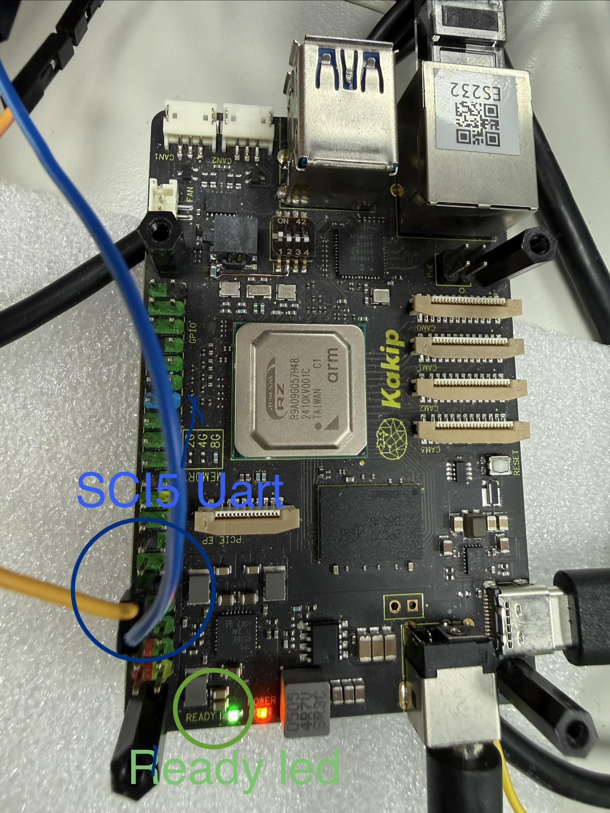
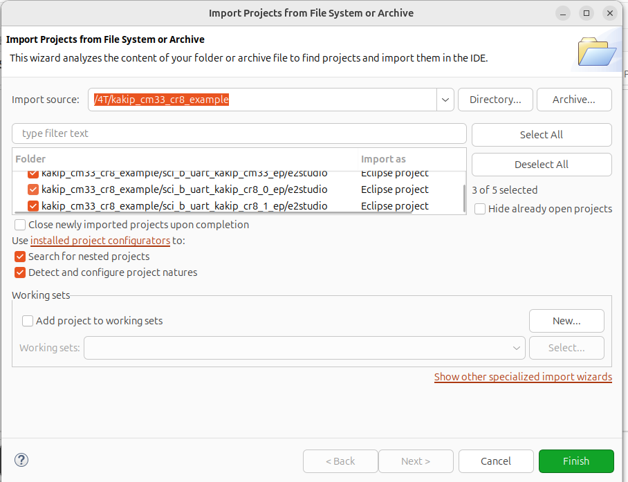
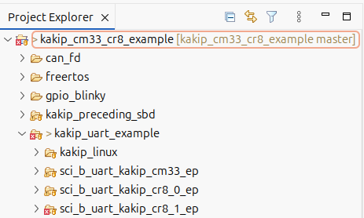
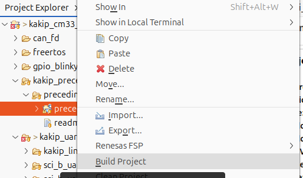
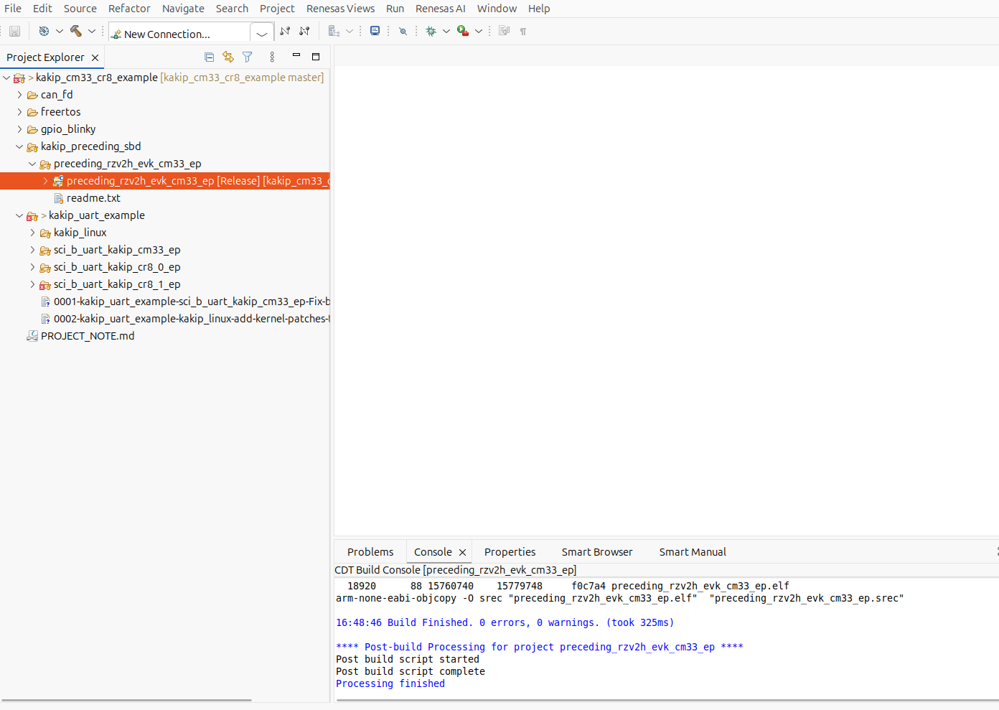
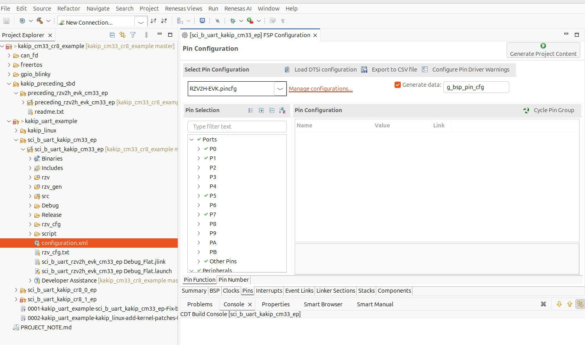
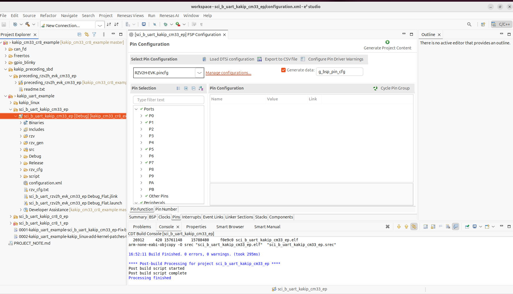
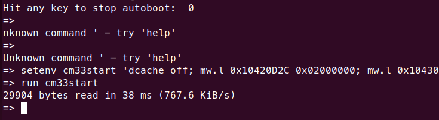
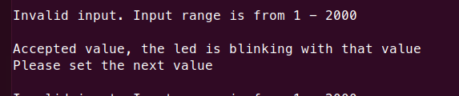

# Kakip UART Example (SCI5) for CM33 / CR8

A UART communication example using SCI5 on the Kakip 40-pin GPIO header. The firmware blinks the READY LED (GREEN) and accepts user input via serial terminal to control the blink period.

## Prerequisites

- Kakip board with OS image from Kakip official website <https://www.kakip.ai/>
- USB-UART adapter (e.g., Pmod USBUART, FTDI cable)
- Serial terminal software (TeraTerm, minicom, etc.)
- e2 studio with RZ/V2H FSP v3.0.0
- GCC ARM Embedded toolchain (13.3.1.arm-13-24)

> **Note:** This project is built with FSP v3.0.0. Using a different FSP version may cause build errors.
> Prebuilt firmware binaries are available in the [firmware/](firmware/) directory for quick testing without building.

## Hardware Connection

Connect the USB-UART adapter to the **40-pin GPIO header (CN6)**:

| CN6 Pin | Signal                  | Connect to           |
| ------- | ----------------------- | -------------------- |
| 6       | GND                     | Adapter GND from PC  |
| 8       | GPIO14 (P7_2) RSCI5_TXD | Adapter RXD from PC  |
| 10      | GPIO15 (P7_3) RSCI5_RXD | Adapter  TXD from PC |



## Build

### 1. Clone the Repository

```bash
$ git clone https://github.com/YDS-Kakip-Team/kakip_cm33_cr8_example.git
```

### 2. Apply Kernel Patches

Apply the following patches to the Kakip Linux kernel source.
Without these patches, the UART will stop working after Linux boots.

```bash
$ cd <kakip_linux>
$ git apply <repo_path>/kakip_uart_example/kakip_linux/arch/arm64/boot/dts/renesas/kakip-es1.dts.diff
$ git apply <repo_path>/kakip_uart_example/kakip_linux/drivers/clk/renesas/r9a09g057-cpg.c.diff
```

| Patch | Purpose |
|-------|---------|
| `kakip-es1.dts.diff` | Disable `&sci5` to prevent Linux serial driver from probing |
| `r9a09g057-cpg.c.diff` | Mark RSCI5 clocks as critical to prevent clock gating |

> **Important:** Rebuild the kernel and deploy the updated Image and DTB to the SD card.
> For kernel build and deploy instructions, refer to the [Kernel Update Guide](../../Kernel-Update_Guide/Kernel-Update_Guide.md).

### 3. Open e2 studio and Import Projects

1. Launch e2 studio and select a workspace (do not use the repository directory as workspace)
2. File -> Open Projects From File System....
3. Click **Directory...** and navigate to the repository root `kakip_cm33_cr8_example/`
4. e2 studio will detect all projects. Select all and click **Finish**



> **Note:** Do **not** check "Copy projects into workspace".

After import, the Project Explorer should show all projects:



> **Note:** The preceding project must keep the original name `preceding_rzv2h_evk_cm33_ep`. Do not rename it.

### 4. Build Preceding Project (Required for CR8)

The CR8 projects depend on the preceding project's Smart Bundle (.sbd) file.
Right-click `preceding_rzv2h_evk_cm33_ep` -> **Build Project**:



Build both Debug and Release configurations (Right-click -> Build Configurations -> Build All):



### 5. Generate Project Content

For each target project (CM33 / CR8_0 / CR8_1):

1. Double-click `configuration.xml` to open the FSP configurator
2. Click **Generate Project Content** (top-right button)



This generates the BSP, HAL drivers, and linker scripts under `rzv/`, `rzv_gen/`, `rzv_cfg/`, `script/`.

### 6. Build Target Project

1. Right-click the target project -> Build Configurations -> Set Active -> **Release**
2. Right-click -> **Build Project**



### 7. Build Output

| Core | Binary | Location |
|------|--------|----------|
| CM33 | `sci_b_uart_kakip_cm33_ep.bin` | `Release/` |
| CR8_0 | `sci_b_uart_kakip_cr8_0_ep_itcm.bin` + `_sram.bin` | `Release/` |
| CR8_1 | `sci_b_uart_kakip_cr8_1_ep_itcm.bin` + `_sram.bin` | `Release/` |

## Deploy

Insert the Kakip SD card into the host PC and mount the boot partition:

```bash
# Check the device name (e.g., /dev/sdb)
$ lsblk

# Mount the boot partition (partition 1)
$ sudo mount /dev/sd<X>1 /mnt
```

Copy all firmware binaries to the boot partition:

```bash
# CM33
$ sudo cp sci_b_uart_kakip_cm33_ep.bin /mnt/

# CR8_0
$ sudo cp sci_b_uart_kakip_cr8_0_ep_itcm.bin /mnt/
$ sudo cp sci_b_uart_kakip_cr8_0_ep_sram.bin /mnt/

# CR8_1
$ sudo cp sci_b_uart_kakip_cr8_1_ep_itcm.bin /mnt/
$ sudo cp sci_b_uart_kakip_cr8_1_ep_sram.bin /mnt/

$ sudo umount /mnt
```

## Run

Stop at the U-Boot prompt (`=>`) by pressing any key during boot. Load **one** firmware at a time, then boot Linux.

> **Note:** These projects are independent and share the same UART port (SCI5). Only run one at a time.

### CM33

```
=> setenv cm33start 'dcache off; mw.l 0x10420D2C 0x02000000; mw.l 0x1043080c 0x08003000; mw.l 0x10430810 0x18003000; mw.l 0x10420604 0x00040004; mw.l 0x10420C1C 0x00003100; mw.l 0x10420C0C 0x00000001; mw.l 0x10420904 0x00380008; mw.l 0x10420904 0x00380038; fatload mmc 0:1 0x08001e00 sci_b_uart_kakip_cm33_ep.bin; mw.l 0x10420C0C 0x00000000; dcache on'
=> saveenv
=> run cm33start
=> boot
```



### CR8_0

```
=> setenv cr8start 'dcache off; mw.l 0x10420D24 0x04000000; mw.l 0x10420600 0xE000E000; mw.l 0x10420604 0x00030003; mw.l 0x10420908 0x1FFF0000; mw.l 0x10420C44 0x003F0000; mw.l 0x10420C14 0x00000000; mw.l 0x10420908 0x10001000; mw.l 0x10420C48 0x00000020; mw.l 0x10420908 0x1FFF1FFF; mw.l 0x10420C48 0x00000000; fatload mmc 0:1 0x12040000 sci_b_uart_kakip_cr8_0_ep_itcm.bin; fatload mmc 0:1 0x08180000 sci_b_uart_kakip_cr8_0_ep_sram.bin; mw.l 0x10420C14 0x00000003; dcache on;'
=> saveenv
=> run cr8start
=> boot
```

### CR8_1

```
=> setenv cr81start 'dcache off; mw.l 0x10420D24 0x04000000; mw.l 0x10420600 0xE000E000; mw.l 0x10420604 0x00030003; mw.l 0x10420908 0x1FFF0000; mw.l 0x10420C44 0x003F0000; mw.l 0x10420C14 0x00000000; mw.l 0x10420908 0x10001000; mw.l 0x10420C48 0x00000020; mw.l 0x10420908 0x1FFF1FFF; mw.l 0x10420C48 0x00000000; fatload mmc 0:1 0x12080000 sci_b_uart_kakip_cr8_1_ep_itcm.bin; fatload mmc 0:1 0x081C0000 sci_b_uart_kakip_cr8_1_ep_sram.bin; mw.l 0x10420C14 0x00000003; dcache on;'
=> saveenv
=> run cr81start
=> boot
```

## Expected Results

- READY LED (GREEN) starts blinking
- Serial terminal (115200 8N1, local echo enabled) shows input prompt
- Enter a value (1-2000) to change the LED blink period in ms



## Troubleshooting

### UART stops working after Linux boots

LED keeps blinking but serial terminal has no response.

**Cause:** Linux CPG driver gates the SCI5 clock.
**Solution:** Apply the kernel patches (see Build Step 2).

### e2 studio: "Invalid device family context"

**Cause:** Preceding project was renamed.
**Solution:** Keep original name `preceding_rzv2h_evk_cm33_ep`.

### e2 studio: "Smart Bundle file is missing"

**Cause:** Preceding project not built yet.
**Solution:** Build `preceding_rzv2h_evk_cm33_ep` first (see Build Step 4).

### CR8: "cannot open linker script file memory_regions.ld"

**Cause:** Generate Project Content not executed.
**Solution:** Open `configuration.xml` -> **Generate Project Content** -> Build (see Build Step 5).
