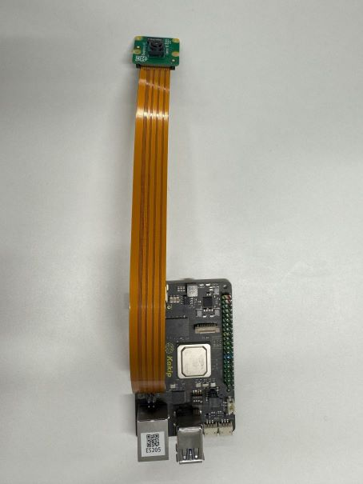
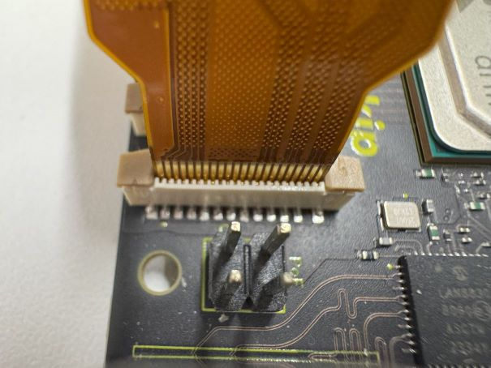
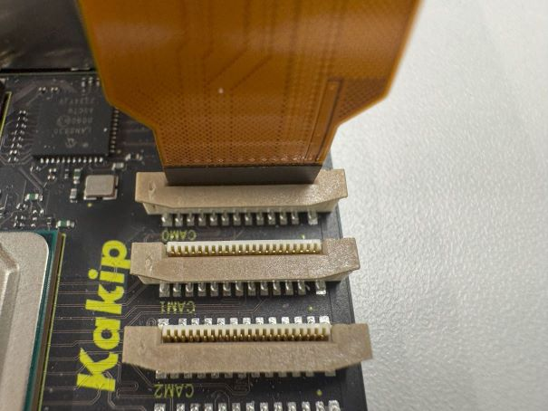
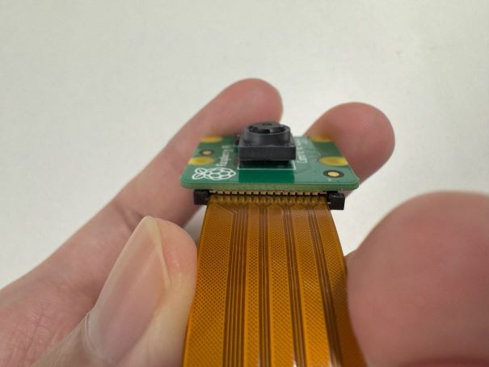
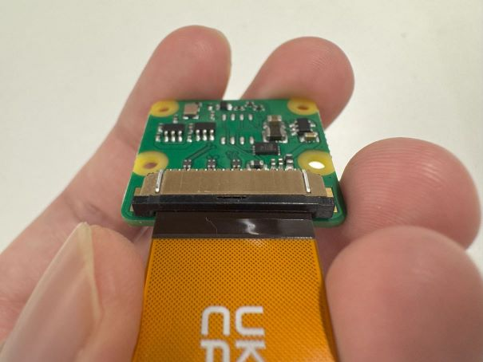

# IMX219対応手順

## 注意事項

1. UDL（ディスプレイリンク）で接続したディスプレイにログインした状態で行ってください。

## 接続構成

KakipとIMX219は以下のように接続してください。
### 全体


### Kakip側の接続



### IMX219側の接続



## 事前準備

1. ビデオパイプラインを設定する。

    ```
    $ media-ctl -d /dev/media<X> -r
    $ media-ctl -d /dev/media<X> -V "'imx219 <X>-0010':0 [fmt:SRGGB8_1X8/640x480 field:none]"
    $ media-ctl -d /dev/media<X> -V "'rzg2l_csi2 160<X>0400.csi2<X>':1 [fmt:SRGGB8_1X8/640x480 field:none]"
    $ media-ctl -d /dev/media<X> -l "'rzg2l_csi2 160<X>0400.csi2<X>':1 -> 'CRU output':0 [1]"
    ```

    ※\<X>の箇所は、接続したCSI端子に応じて変更してください。CAM0端子なら`0`、CAM1端子なら`1`となります。
    ※例えば、CAM0端子の場合は以下になります。
    ```
    $ media-ctl -d /dev/media0 -r
    $ media-ctl -d /dev/media0 -V "'imx219 0-0010':0 [fmt:SRGGB8_1X8/640x480 field:none]"
    $ media-ctl -d /dev/media0 -V "'rzg2l_csi2 16000400.csi20':1 [fmt:SRGGB8_1X8/640x480 field:none]"
    $ media-ctl -d /dev/media0 -l "'rzg2l_csi2 16000400.csi20':1 -> 'CRU output':0 [1]"
    ```

2. 取得映像の明るさを調整する。
    
    ```
    $ v4l2-ctl --set-ctrl=digital_gain=1000
    $ v4l2-ctl --set-ctrl=analogue_gain=100
    ```

## 映像取得手順

1. IMX219から映像を取得し、ディスプレイに表示する。

    ```
    $ gst-launch-1.0 v4l2src device=/dev/video0 ! video/x-bayer,format=bggr,width=640,height=480,framerate=30/1 ! bayer2rgb ! autovideosink sync=false
    ```