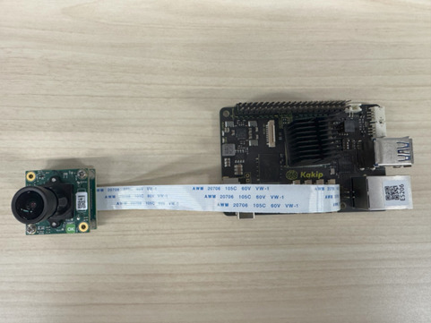
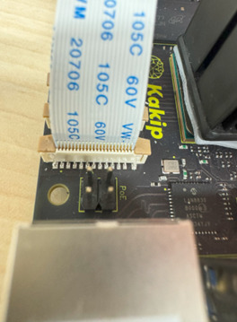
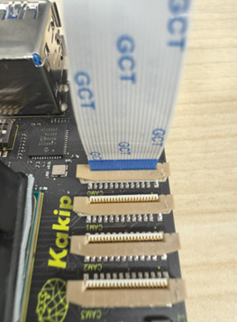
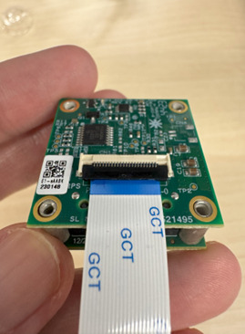

# IMX462対応手順書

## ビルド手順

### クロスコンパイル

#### 前提条件

[Renesas社の手順](https://renesas-rz.github.io/rzv_ai_sdk/5.00/getting_started.html)を参考にRZ/V2H用AI SDKのコンテナイメージを作成してください。

#### 事前準備
1. kakipのカーネルソースのリポジトリのクローンを行う。
    ```
    git clone https://github.com/YDS-Kakip-Team/kakip_linux.git
    ```

3. カーネルコンフィグを設定する。
    ```
    cd ./kakip_linux
    cp ./arch/arm64/configs/kakip.config ./.config
    ```

4. ビルド環境(コンテナ)を起動する。
    ```
    sudo docker run --rm -it -v $PWD:/kakip_linux -w /kakip_linux rzv2h_ai_sdk_image
    ```

6. 環境変数の設定と依存パッケージのインストールを行う。
    ```
    source /opt/poky/3.1.31/environment-setup-aarch64-poky-linux
    export PKG_CONFIG_DIR=/opt/poky/3.1.31/sysroots/aarch64-poky-linux/usr/lib64/pkgconfig
    export PKG_CONFIG_LIBDIR=/opt/poky/3.1.31/sysroots/aarch64-poky-linux/usr/lib64/pkgconfig
    export PKG_CONFIG_PATH=$PKG_CONFIG_PATH:/opt/poky/3.1.31/sysroots//aarch64-poky-linux/usr/share/pkgconfig
    unset PKG_CONFIG_SYSROOT_DIR
    apt update && apt install -y flex bison bc libssl-dev
    ```

#### ビルド手順
1. 必要なカーネルコンフィグを有効化する。
    ```
    cd /kakip_linux
    make menuconfig
    ```
    以下のカーネルコンフィグを有効化（"y"に設定）してください。
    - CONFIG_VIDEO_ECAM_IMX462

2. カーネルイメージをビルドする。
    ```
    make -j4 Image
    ```
    ビルド成果物は以下です。
    - ./arch/arm64/boot/Image

3. デバイスツリーをビルドする。
    ```
    make -j4 renesas/kakip-es1-imx462.dtb
    ```
    ビルド成果物は以下です。
    - ./arch/arm64/boot/dts/renesas/kakip-es1-imx462.dtb

4. ビルド後はexitでコンテナから抜ける。
    ```
    exit
    ```

#### カーネルの更新手順
1. SDカードをPCにマウントする。

    /mntに手動でマウントする場合の手順です。  
    自動マウントされる環境の場合は、以降マウント先のパスを読み替えてください。

    ```
    # sd<X>は環境によります。
    sudo mount /dev/sd<X>2 /mnt
    ```

2. ビルドしたカーネルイメージとdtbファイルを更新する。

    ```
    sudo cp ./arch/arm64/boot/Image /mnt/boot/Image-5.10.145-cip17-yocto-standard
    sudo cp ./arch/arm64/boot/dts/renesas/kakip-es1-imx462.dtb /mnt/boot/kakip-es1-imx462.dtb
    ```

4. カーネルイメージとdtbファイルを更新したSDカードでkakipを起動する。

5. kakipで以下のコマンドを実行する。
    ```
    sudo ln -sfn kakip-es1-imx462.dtb /boot/kakip-es1.dtb
    ```

6. kakipを再起動する。
    ```
    sudo shutdown -r now
    ```

### セルフコンパイル
#### 事前準備
1. kakipのカーネルソースのリポジトリのクローンを行う。
    ```
    git clone https://github.com/YDS-Kakip-Team/kakip_linux.git
    ```

2. カーネルコンフィグを設定する。
    ```
    cd ./kakip_linux
    cp ./arch/arm64/configs/kakip.config ./.config
    ```

#### ビルド手順
1. 必要なカーネルコンフィグを有効化する。
    ```
    make menuconfig
    ```
    以下のカーネルコンフィグを有効化（"y"に設定）してください。
    - CONFIG_VIDEO_ECAM_IMX462

2. カーネルイメージをビルドする。
    ```
    make -j4 Image
    ```
    ビルド成果物は以下です。
    - ./arch/arm64/boot/Image

3. デバイスツリーをビルドする。
    ```
    make -j4 renesas/kakip-es1-imx462.dtb
    ```
    ビルド成果物は以下です。
    - ./arch/arm64/boot/dts/renesas/kakip-es1-imx462.dtb

#### カーネルの更新手順
1. ビルドしたカーネルイメージとdtbファイルを更新する。
    ```
    sudo cp ./arch/arm64/boot/Image /boot/Image-5.10.145-cip17-yocto-standard
    sudo cp ./arch/arm64/boot/dts/renesas/kakip-es1-imx462.dtb /boot/kakip-es1-imx462.dtb
    ```

2. 以下のコマンドを実行する。
    ```
    sudo ln -sfn kakip-es1-imx462.dtb /boot/kakip-es1.dtb
    ```

3. kakipを再起動する。
    ```
    sudo shutdown -r now
    ```

## 映像取得手順
### 注意事項

1. UDL（ディスプレイリンク）で接続したディスプレイにログインした状態で行ってください。

### 接続構成

KakipとIMX219は以下のように接続してください。
#### 全体


#### Kakip側の接続



#### IMX219側の接続


### 事前準備

1. ビデオパイプラインを設定する。

    ```
    media-ctl -d /dev/media<X> -r
    media-ctl -d /dev/media<X> -l "'rzg2l_csi2 160<X>0400.csi2<X>':1 -> 'CRU output':0 [1]"
    media-ctl -d /dev/media<X> -V "'rzg2l_csi2 160<X>0400.csi2<X>':1 [fmt:UYVY8_2X8/1920x1080 field:none]"
    media-ctl -d /dev/media<X> -V "'imx462 <X>-001f':0 [fmt:UYVY8_2X8/1920x1080 field:none]"
    ```

    ※\<X>の箇所は、接続したCSI端子に応じて変更してください。CAM0端子なら`0`、CAM1端子なら`1`となります。
    ※例えば、CAM0端子の場合は以下になります。
    ```
    media-ctl -d /dev/media0 -r
    media-ctl -d /dev/media0 -l "'rzg2l_csi2 16000400.csi20':1 -> 'CRU output':0 [1]"
    media-ctl -d /dev/media0 -V "'rzg2l_csi2 16000400.csi20':1 [fmt:UYVY8_2X8/1920x1080 field:none]"
    media-ctl -d /dev/media0 -V "'imx462 0-001f':0 [fmt:UYVY8_2X8/1920x1080 field:none]"
    ```

### 映像取得手順

1. IMX462から映像を取得し、ディスプレイに表示する。

    ```
    gst-launch-1.0 v4l2src device=/dev/video0 ! 'video/x-raw, format=UYVY, width=1920, height=1080' ! videoconvert ! waylandsink sync=false
    ```