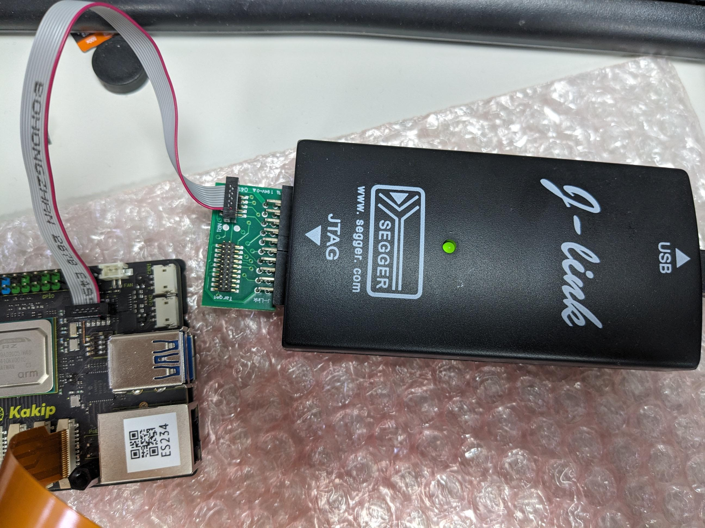

# Kakip J-Link SWD Debug Guide

## Document Information
| Item | Description |
|-------------------|---------------------------------------|
| Document Title | Kakip J-Link SWD Debug Guide |
| Target Device | Kakip |
| Debug Tool | SEGGER J-Link |
| Debug Interface | SWD |
| Applicable Cores | Cortex-R8, Cortex-M33 |
| Document Type | Customer Debug Guide |
| Author | LC Wang |
| Revision | v1.0 |
----------
## Document Purpose

This document describes how to connect and debug the **Kakip** using **SEGGER J-Link** over the **SWD interface**.
The procedure applies to both **Cortex-R8** and **Cortex-M33** cores.

----------

## 1. Hardware Setup

### 1.1 Hardware Revision Requirement

For **R9A09G057H42 hardware revisions ES2 and earlier**, a **hardware rework is required** before SWD debugging can be performed.
-   **Applicable revisions**
    -   ES2
    -   ES1
    -   Earlier revisions
-   **Rework definition**
    -   **R126 removed → hardware reworked**

If the board has already been reworked (R126 removed), no further hardware modification is required.

----------

### 1.2 Hardware Rework Responsibility

The required hardware rework applies **only to ES2 and earlier revisions**.
Detailed rework procedures, verification steps, and revision confirmation **must be handled by the official hardware vendor**.
For all hardware-related inquiries, please contact:
-   **Yuridenki Official Technical Support**
    📧 **contact@yuridenki.co.jp**
----------

> **Important Notice**
>
> SWD debugging on **ES2 and earlier hardware revisions** is supported **only after the required hardware rework has been completed** (**R126 removed**).
>
> Please contact **Yuridenki official technical support** (contact@yuridenki.co.jp) for hardware rework details and confirmation.

## 2. Tools and Software Preparation

### 2.1 J-Link Software

Download the latest **SEGGER J-Link software package** from the official SEGGER website:

[https://www.segger.com/downloads/jlink/](https://www.segger.com/downloads/jlink/)

SEGGER provides installation packages for multiple host operating systems, including **Windows** and **Linux**.
Please download the installer that matches your host environment.

----------

### Default Host Environment (This Document)

The default host environment used in this document is:

-   **Operating System**: Ubuntu 24.04 LTS (Linux)


For Ubuntu-based systems, please download the **Linux (DEB installer)** from the SEGGER website, for example:

`64-bit DEB Installer`

_(The exact filename may vary depending on the J-Link version.)_

----------

### Installation on Ubuntu

After downloading the DEB package, install J-Link using the following command:

`sudo dpkg -i 64-bit DEB Installer`

If dependency issues occur, resolve them with:

`sudo apt -f install`

----------

### Verification

After installation, verify that J-Link is installed correctly:

`JLinkExe`

If the J-Link Commander prompt appears, the installation was successful.

----------

### Note

> Users working on **Windows** hosts should download and install the corresponding Windows installer provided by SEGGER.
> Installation steps may differ depending on the operating system.

### 2.2 Hardware Requirements

- SEGGER J-Link
- Correct SWD wiring:
	- SWDIO
	- SWCLK
	- GND
	- VTref
----------

## 3. Cortex-R8 (R8 Core) Debug via SWD

### 3.1 Prerequisites

- R126 removed
- SWD interface connected
- Power applied to the target board
----------

### 3.2 Connection Procedure

Start J-Link Commander:
`JLinkExe`

In the J-Link prompt, enter:
`connect`

Configure as follows:
-  **Device**

`R9A09G057H42_R8_0`
-  **Target Interface**
`S (SWD)`

-  **Interface Speed**
`4000 kHz (Default)`

----------

### 3.3 Successful Connection Indicators

A successful connection shows messages similar to:
```
Found Cortex-R8 r0p3
Debug architecture ARMv7.0
```
This indicates:

- SWD communication is established
- Cortex-R8 core is correctly identified

----------

### 3.4 Halting the Cortex-R8 Core

To halt the core:
`Halt`

Expected behavior:
- The core enters halt state
- Register values (PC, CPSR, general registers) are displayed

**Note**
A program counter value of `0x00000000` is normal if no firmware is running.

----------

## 4. Cortex-M33 (M33 Core) Debug via SWD

### 4.1 Use Case

Cortex-M33 is typically used for:
- Secure / control firmware
- Boot and system management
- Early bring-up and debug
----------

### 4.2 Connection Procedure

Start J-Link Commander:
`JLinkExe`

Enter:
`connect`

Configure as follows:
-  **Device**
`R9A09G057H42_M33_0`

-  **Target Interface**
`S (SWD)`

-  **Interface Speed**
`4000 kHz`

----------

### 4.3 Successful Connection Indicators

During connection, J-Link automatically:

- Enables CM33 clock
- Releases CM33 from reset
- Detects boot mode

Successful connection output includes:
```
Found Cortex-M33 r0p4
Security extension: implemented
Secure debug: enabled
```

This indicates:
- Cortex-M33 is accessible
- Secure debug is enabled
- The core is ready for debugging

----------

## 5. Troubleshooting

### 5.1 SWD Cannot Connect

Check the following in order:

1. Confirm **R126 has been removed**
2. Verify VTref is approximately **1.8 V**
3. Check SWD wiring
4. Ensure the correct device is selected (R8 vs M33)

----------

### 5.2 Cannot Halt the CPU

Possible causes:
- CPU is executing code immediately after reset
Recommended actions:
- Connect J-Link immediately after power-on
- Confirm R126 removal
- Verify correct target core selection

----------

## 6. Test Environment

| Item | Value |
|-------------------|----------------------|
| J-Link Commander | V8.26 |
| J-Link Firmware | EDU Mini V1 |
| Target Voltage | ~1.77–1.78 V |
| Host OS | Ubuntu 22.04.3 LTS (Jammy Jellyfish) |

----------

## Revision History

| Version | Date | Description |
|---------|----------|-------------------------|
| v1.0 | 2026-01 | Initial public release |

## Appendix A. J-Link SWD Connection Example

**Figure A-1. J-Link connected to the target board via SWD**

The figure above shows a typical **SEGGER J-Link** connection to the target board using the **SWD interface**.

### Connection Description

-   **Debug Probe**: SEGGER J-Link
-   **Interface**: SWD
-   **Connection Method**:
    -   J-Link → SWD adapter board
    -   Flat ribbon cable → Target board SWD header
