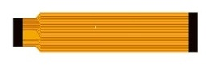
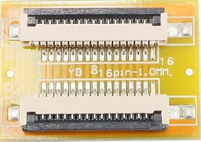
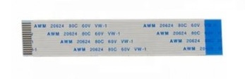
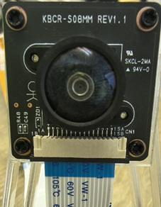
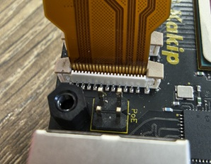

# KBCR-S08MM対応手順

## H/Wの注意事項
KBCR-S08MMとの接続には、Raspberry Piに準じたカメラのFPCケーブルでは接続できません。KBCR-S08MMはMIPI-CSI2の15ピンI/Fのカメラですが、kakipと接続する場合は逆面タイプのFPCケーブル（電極面が表と裏で反対側を向いているもの）を用いて接続する必要があります。

## ビルド手順

### クロスコンパイル

#### 前提条件

[Renesas社の手順](https://renesas-rz.github.io/rzv_ai_sdk/5.20/getting_started.html)を参考にRZ/V2H用AI SDKのコンテナイメージを作成してください。

#### 事前準備
1. kakipのカーネルソースのリポジトリのクローンを行う。
    ```
    $ git clone https://github.com/YDS-Kakip-Team/kakip_linux.git
    ```

2. カーネルコンフィグを設定する。
    ```
    $ cd ./kakip_linux
    $ cp ./arch/arm64/configs/kakip.config ./.config
    ```

3. ビルド環境(コンテナ)を起動する。
    ```
    $ sudo docker run --rm -it -v $PWD:/kakip_linux -w /kakip_linux rzv2h_ai_sdk_image
    ```

4. 環境変数の設定と依存パッケージのインストールを行う。
    ```
    # source /opt/poky/3.1.31/environment-setup-aarch64-poky-linux
    # export PKG_CONFIG_DIR=/opt/poky/3.1.31/sysroots/aarch64-poky-linux/usr/lib64/pkgconfig
    # export PKG_CONFIG_LIBDIR=/opt/poky/3.1.31/sysroots/aarch64-poky-linux/usr/lib64/pkgconfig
    # export PKG_CONFIG_PATH=$PKG_CONFIG_PATH:/opt/poky/3.1.31/sysroots//aarch64-poky-linux/usr/share/pkgconfig
    # unset PKG_CONFIG_SYSROOT_DIR
    # apt update && apt install -y flex bison bc libssl-dev
    ```
    
#### ビルド手順
1. パッチを適応させる
    ```
    # cd /kakip_linux
    # wget https://raw.githubusercontent.com/YDS-Kakip-Team/kakip_docs/main/KBCR-S08MM_Guide/kakip_ox01f10_driver.patch
    # patch -p1 -b <  kakip_ox01f10_driver.patch
    ```

2. デバイスツリーをビルドする。
    ```
    # make renesas/overlays/kakip-es1-ox01f10-overlay.dtb
    ```
    以下のカーネルコンフィグの設定確認で、"y"に設定してください。
    - OmniVision OX01F10 sensor support (VIDEO_OX01F10) [N/m/y/?] (NEW)

    ビルド成果物は以下です。
    - ./arch/arm64/boot/dts/renesas/overlays/kakip-es1-ox01f10-overlay.dtb

3. カーネルイメージをビルドする。
    ```
    # make -j$(nproc) all
    ```
    ビルド成果物は以下です。
    - ./arch/arm64/boot/Image

4. ビルド後はexitでコンテナから抜ける。
    ```
    # exit
    ```

#### カーネルの更新手順

#### カーネルイメージとdtbファイルの配置
1. SDカードをPCにマウントする。

    /mntに手動でマウントする場合の手順です。  
    自動マウントされる環境の場合は、以降マウント先のパスを読み替えてください。

    ```
    # sd<X>は環境によります。
    $ sudo mount /dev/sd<X>2 /mnt
    ```

2. ビルドしたカーネルイメージを更新する。

    ```
    $ sudo cp ./arch/arm64/boot/Image /mnt/boot/Image-5.10.145-cip17-yocto-standard
    ```

3. ビルドしたdtbファイルをdtboファイルとして配置する。
    ```
    $ sudo cp ./arch/arm64/boot/dts/renesas/overlays/kakip-es1-ox01f10-overlay.dtb /mnt/boot/kakip-es1-ox01f10.dtbo
    ```

#### kakipでのdtboファイルの適用
1. カーネルイメージとdtbファイルを更新したSDカードでkakipを起動する。

2. kakipで以下のコマンドを実行する。
    ```
    $ sudo fw_setenv boot_fdt_overlay yes
    $ sudo fw_setenv fdt_overlay_files kakip-es1-ox01f10
    ```

3. kakipを再起動する。
    ```
    $ sudo shutdown -r now
    ```

## 映像取得手順

### 注意事項

1. UDL（ディスプレイリンク）で接続したディスプレイにログインした状態で行ってください。

### 接続構成

KBCR-S08MMはMIPI-CSI2の15ピンI/Fのカメラですが、kakipと接続する場合は逆面タイプのFPCケーブル（電極面が表と裏で反対側を向いているもの）を用いて接続する必要があります。ここでは、入手性の面からFPCコネクタ延長アダプタを組み合わせた例を説明します。

#### ケーブル＆延長アダプタ
- kakip接続FPCケーブル(22ピンー15ピン、Raspberry Piに準じたFPCケーブル)



- 延長アダプタ(15ピンー15ピン)



- KBCR-S08MM接続側FPCケーブル(15ピン、逆面タイプ)



#### カメラ側の接続


#### Kakip側の接続


### 事前準備

ビデオパイプラインを設定する。

```
$ media-ctl -d /dev/media<X> -r 
$ media-ctl -d /dev/media<X> -l "'rzg2l_csi2 160<X>0400.csi2<X>':1 -> 'CRU output':0 [1]" 
$ media-ctl -d /dev/media<X> -V "'rzg2l_csi2 160<X>0400.csi2<X>':1 [fmt:UYVY8_2X8/1344x1020 field:none]" 
$ media-ctl -d /dev/media<X> -V "'ox01f10 <X>-0036':0 [fmt:UYVY8_2X8/1344x1020 field:none]"
```

※\<X>の箇所は、接続したCSI端子に応じて変更してください。CAM0端子なら`0`、CAM1端子なら`1`となります。
※例えば、CAM0端子の場合は以下になります。

```
$ media-ctl -d /dev/media0 -r 
$ media-ctl -d /dev/media0 -l "'rzg2l_csi2 16000400.csi20':1 -> 'CRU output':0 [1]" 
$ media-ctl -d /dev/media0 -V "'rzg2l_csi2 16000400.csi20':1 [fmt:UYVY8_2X8/1344x1020 field:none]" 
$ media-ctl -d /dev/media0 -V "'ox01f10 0-0036':0 [fmt:UYVY8_2X8/1344x1020 field:none]"
```

### 映像取得手順

KBCR-S08MMから映像を取得し、ディスプレイに表示する。

```
$ gst-launch-1.0 v4l2src device=/dev/video0 ! 'video/x-raw, format=UYVY, width=1344, height=1020' ! videoconvert ! autovideosink sync=false
```

### カメラ設定
ゲイン等各種カメラ設定方法については、シキノハイテック殿へお問い合わせください

