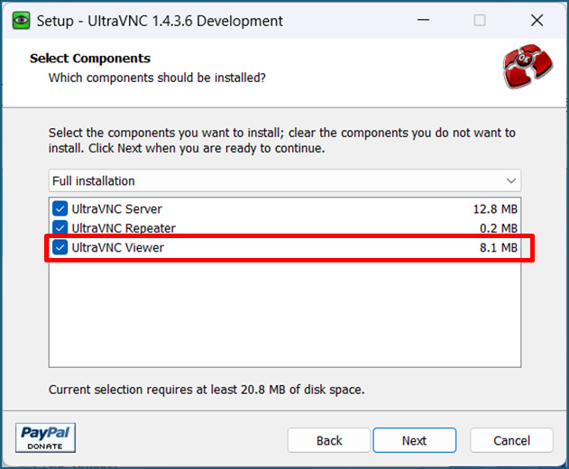
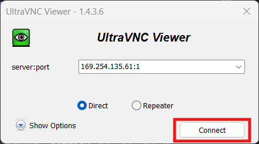

# VNCサーバ対応手順書

## 注意事項

1. UDL（ディスプレイリンク）で接続したディスプレイでログインしているとVNCサーバを起動できないため、UDLが未接続の状態か、以下のログイン画面が表示されている状態で行うこと。


## Kakipでの VNCサーバの起動

1. VNCサーバを起動する

    ```
    $ tigervncserver -xstartup /usr/bin/gnome-session -SecurityTypes VncAuth,TLSVnc -geometry 800x600 -localhost no :1
    
    New Xtigervnc server 'localhost:1 (ubuntu)' on port 5901 for display :1.
    Use xtigervncviewer -SecurityTypes VncAuth,TLSVnc -passwd /tmp/tigervnc.AcfDdJ/passwd localhost:1 to connect to the VNC server.
    ```

2. KakipのIPアドレスを確認する ※VNCサーバに接続する際に指定
    
    ※以下の例では"169.254.135.61"
    ```

    $ ifconfig
    dummy0: flags=195<UP,BROADCAST,RUNNING,NOARP>  mtu 1500
        ether 42:28:ba:c5:ae:90  txqueuelen 1000  (イーサネット)
        RX packets 0  bytes 0 (0.0 B)
        RX errors 0  dropped 0  overruns 0  frame 0
        TX packets 13  bytes 2094 (2.0 KB)
        TX errors 0  dropped 0 overruns 0  carrier 0  collisions 0

    end0: flags=4163<UP,BROADCAST,RUNNING,MULTICAST>  mtu 1500
        inet 169.254.135.61  netmask 255.255.255.0  broadcast 0.0.0.0
        ether 44:b7:d0:cc:07:44  txqueuelen 1000  (イーサネット)
        RX packets 88  bytes 16898 (16.8 KB)
        RX errors 0  dropped 0  overruns 0  frame 0
        TX packets 279  bytes 45902 (45.9 KB)
        TX errors 0  dropped 0 overruns 0  carrier 0  collisions 0
        device interrupt 156

    lo: flags=73<UP,LOOPBACK,RUNNING>  mtu 65536
        inet 127.0.0.1  netmask 255.0.0.0
        inet6 ::1  prefixlen 128  scopeid 0x10<host>
        loop  txqueuelen 1000  (ローカルループバック)
        RX packets 13257  bytes 968215 (968.2 KB)
        RX errors 0  dropped 0  overruns 0  frame 0
        TX packets 13257  bytes 968215 (968.2 KB)
        TX errors 0  dropped 0 overruns 0  carrier 0  collisions
    ```

## クライアントPC（Windows想定）への Ultra VNCのインストール

1. [公式ページ](https://uvnc.com/downloads/ultravnc.html)から、インストーラをダウンロードする


    ※ここではバージョン1.4.3.6をダウンロード

    

    

2. インストーラを実行して Ultra VNCをインストールする
    
    ※「UltraVNC Viewer」は必ずインストールすること

    

## クライアントPCから VNCサーバへの接続

1. KakipとクライアントPCを同一ネットワークに接続する

    例：下図のように接続
    

2. クライアントPCで UltraVNC Viewerを起動する

3. [VNC Server] の欄に [IP アドレス:1] を入力する
    
    

4. [connect]をクリックする

    

5. 初期パスワード「ubuntu」を入力して[Log on]をクリックする

    

6. 以下のような画面が出れば接続できている

    

## Kakipでの UDLで接続したディスプレイへのログイン

VNCサーバ起動後にUDLで接続したディスプレイへログインを行う場合は、以下の手順を実行すること。

1. VNCサーバを停止する

    ```
    $ vncserver -kill :1
    ```

2. GDMサービスを再起動する

    ```
    $ sudo systemctl restart gdm
    ```

4. UDLで接続したディスプレイへログインする